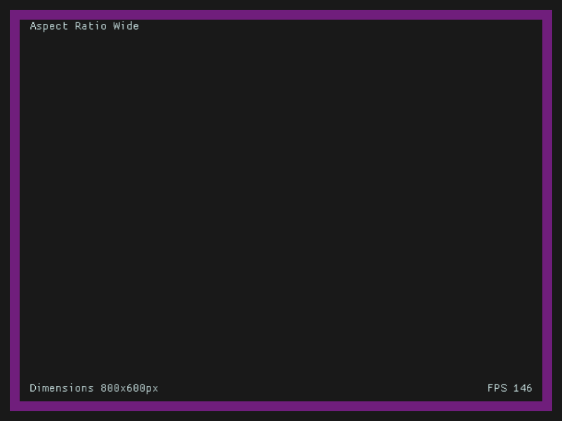

# Rust UI Experiments
This repository is to gather up and expand various old and new experiments 
created to test some ideas about user interfaces programmed in Rust.

## Opinions

I have some opinions on what makes a good user interface and these experiments
are designed to test those opinions and see if they make for a good experience
in prototype applications.

The hope for this collection of experiments is that graphical software can be
created that is small in download size, performant, works on a wide variety of
platforms, works on devices with diverse input options, and is usable by people
with varying abilities.

### Opinion: Aspect Ratio Agnostic User Interfaces are Good
Displays can have varying aspect ratios and windowed environments can have the
window aspect ratio changed at the user's whim. This experiment is to determine
if a single layout can be created that works for all aspect ratios.

The general idea is to have UI elements pinned to regions of the screen with
optional maximum bounds set so very wide or very tall displays don't move
the UI elements too far out of the user's area of focus.

The primary interaction area also needs to scale to achieve a balance between a 
useable zoom level and being able to see a similar amount of content at 
differing aspect ratios.

### Opinion: WASM is a Good Platform
WASM and WebAssembly offer an opportunity for a low barrier to entry platform
for both gamers and game developers. It offers many of the benefits
of Flash and Java without the security drawbacks. Common web browers implement
WASM so there is an already-deployed platform on many devices and the WASM
specification is small so implemenmting a WASM platform for devices without 
web browsers is an feasable task.

#### Desired Properties
- Application can fill the entire viewport or fit a DOM element when in a Web browser
- Low CPU, GPU, memory, and bandwidth requirements
- Handle input from keyboard, mouse, touch, pen, game controllers, and TV style remote controls with limited buttons
- Low latency from input to display update
- Low latency between internal state update and display update

### Opinion: Application Binaries Should be Small
I don't know exactly what a reasonable cutoff should be but my initial target
is 2MB for a graphical application compiled to WASM for a Web browser.

### Opinion: Input Should Be Configurable to User Needs
UIs should have input mapping to abstract inputs to actions and the application
should allow the user to configure the inputs however they want.
and I've created experiments mapping keyboard, mouse, and joypad to actions

### Opinion: Vector Graphics can be Fast and Look Good
I've created a few small vector graphics games with Rust using 
tesselation, render caching, and hybrid approaches but never explored which are
best beyond making the games "fast enough". These experiments are to quantify 
the performance of various techniques.

#### Crates Supporting Opinions

- [macroquad](https://github.com/not-fl3/macroquad) - 
  [Fish Game](https://github.com/heroiclabs/fishgame-macroquad) 
  [(live demo)](https://fedorgames.itch.io/fish-game)
  - Stripped Fish Game wasm is about 1.2MB
  - Very low CPU usage even when updating screen at 60fps with the fish game demo (about 0.01%)
  - Does not resize to browser viewport size
  - Browser zoom is blurry (something like bilinear filtering)

- [egui](https://github.com/emilk/egui) - [Web demo](https://www.egui.rs/#demo)
  - Stripped Web demo wasm is about 4.5MB
  - Low CPU usage even when updating screen at 60fps with the fractal clock animation (about 1%)
  - Almost zero CPU usage when widgets are not updating
  - Fills the browser viewport and resizes with window size and aspect ratio changes
  - Demonstrates "reactive" layout that changes depending on viewport size
  - Handles browser scaling without pixelating text

- [BEVY](https://bevyengine.org/) - [Breakout Demo](https://bevyengine.org/examples/games/breakout/)
  - Stripped Breakout wasm is about 13.8MB
  - High CPU usage in breakout demo (about 25%)
  - Demos partially resize to DOM element area
  - Demos show some elements of responsive layout
  - Handles browser scaling without pixelating text

## Project Status
- [x] Write a README
- [ ] Experiment: aspect-ratio
- [ ] Experiment: wasm
- [ ] Experiment: small
- [ ] Experiment: input-mapping
- [ ] Experiment: vector-graphics

## Usage
This repo is organized as a cargo workspace. Use the `cargo --package` to
compile and run one of the experiments. For example:

~~~
cargo run --package aspect-ratio
~~~

## A Note on Licenses
You may use the code I wrote in this repository under the MIT and/or 
Apache 2.0 licences. See the LICENCE-APACHE and LICENSE-MIT files.

Code in this repository other than my own may be under different licenses.
I will make an attempt to mark third party code and link to sources but
I make no guarentees that I have marked all third party code appropriately.
These experiments may contain snippets taken from books, other repositories, 
forums etc., and haven't undergone the full rigor of software meant for 
release and distribution.

